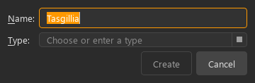
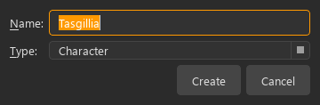
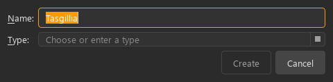
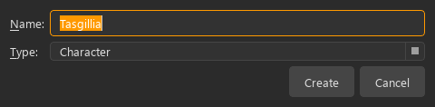

# KRT-14: deliberate entity classification

Implemented 2026-10-06. These are automated functional checks and assisted Qt
renders, not a new human benchmark or a measured usability improvement.

Normal Explorer **New → Create Entity**, its empty-state Create Entity button,
and the existing Ctrl+I shortcut share `EditorCoordinator.create_entity()`.
The single initial capture form now asks for Name and Type together. Type starts
empty on every normal creation; **Create** is disabled until both trimmed fields
are nonempty, and Enter cannot bypass that guard. Common choices appear first:
Character, Location, Faction, Item, Concept. Cached world types follow, and typing
a custom type remains possible. There is no previous-choice or Concept default.

The map Quick Capture wrapper uses the same form with an explicit Concept
default. Provisional Wiki/Peek creation still defaults to Concept and preserves
the originating editing context. Commands, storage and existing type editing
semantics are unchanged.

## Contract mapping

| Contract | Behavior and evidence |
| --- | --- |
| 1, 4, 7, 10 | Visible Name/Type labels, an empty “Choose or enter a type” prompt, five common choices, custom entry, and one capture form rather than sequential prompts. Covers KA-01/04 intentions without changing benchmark wording. |
| 2, 6 | Name starts focused; Tab reaches Type, Alt+N/Alt+T use label buddies. Enter accepts only a complete request; popup/completion keys remain Qt-owned. Escape cancels the local form. Create visibly reflects completeness. |
| 3 | Retains the existing initial modal capture as a bounded exception: the object does not yet exist to inspect, and name/classification are captured before changing context. Ordinary subsequent editing remains in the inspector; this adds no modal chain or contract revision. |
| 5, 8 | Shared name/type presentation with map capture and the shared ScrollSafeComboBox. Cancellation precedes draft guards; confirmed normal creation retains source Save/Discard/Cancel safeguards and opens the created entity. Provisional capture intentionally retains its origin. |
| 9 | One CreateEntityCommand persists the chosen type and retains identity across undo/redo. No storage mutation occurs for incomplete/cancelled capture. |

## Validation

- Focused Qt/navigation/context/map suites: **104 passed**.
- Bounded `pytest -m ci_fast -q`: **1,452 passed, 2 skipped**.
- Ruff `src/ tests/`: passed; mypy on all three changed production modules:
  no issues; collection policy passed with twelve new `ci_fast` cases.
- Real modal capture through Explorer was exercised with Character, Faction
  and custom Airship, followed by database readback, undo and redo.
- Existing cancellation, draft guards, active selection, search/filter reveal,
  context-tag factory and map capture regressions passed. Quick Capture's
  Concept default and provisional context retention were checked explicitly.

## Rendered evidence

Offscreen PySide6 6.10.1 on Windows, `src/resources/main.qss` through ThemeManager,
dark mode, Segoe UI 10 pt with Segoe UI regular/bold/italic font files explicitly
registered from `C:/Windows/Fonts`, isolated temporary INI QSettings.
Create `EntityCreationDialog(entity_types=["Ship"])`, set Name to Tasgillia,
resize to each width and `sizeHint().height()`, show/process Qt events and grab;
then select Character and grab again. Both states were visually inspected at
360 px and 480 px: prompt, selected type, labels and buttons fit without clipping.
This checks Qt rendering, not native interactive first-use learnability.

| Width | Required choice | Complete capture |
| --- | --- | --- |
| 360 px |  |  |
| 480 px |  |  |
