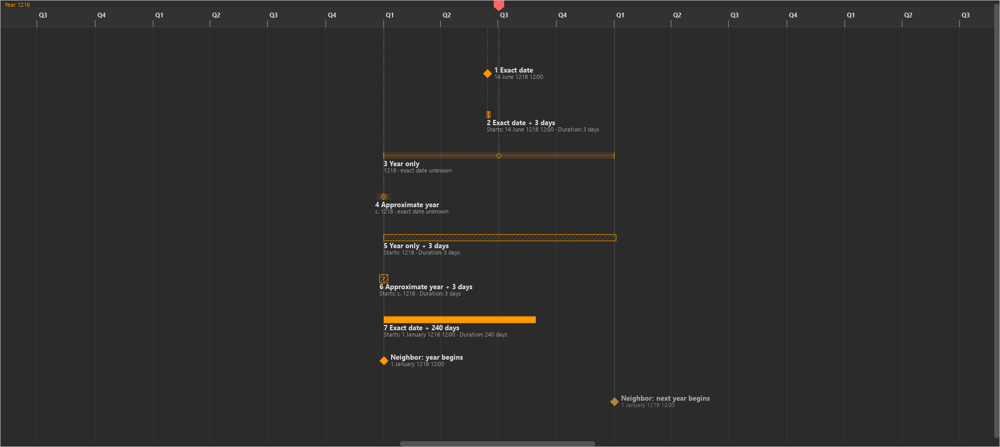
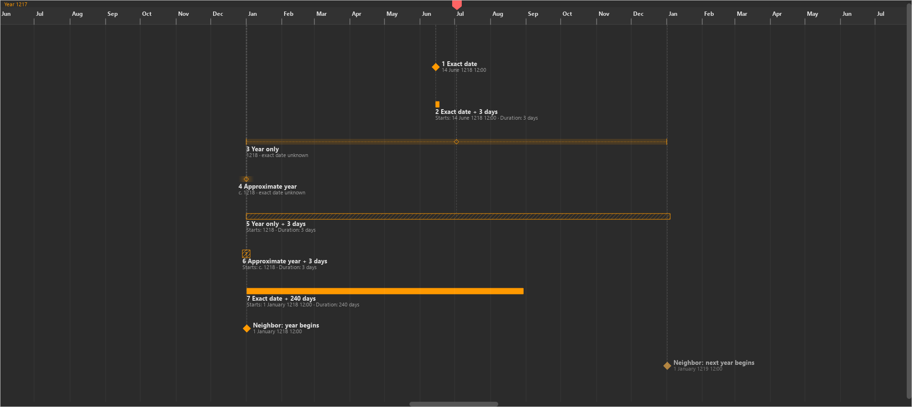

# KRT-50 baseline investigation

Investigated 2026-10-07 against `e8a00a8bdc30efa42985883940901d395750712a`
(v0.19.7). [Issue](https://linear.app/projektkraken/issue/KRT-50/separate-occurrence-uncertainty-from-event-duration-in-timeline-visual).
Production code is unchanged. These are baseline captures, not a proposed fix.

The [extended indicator review](indicators-review.md) covers other temporal marks,
navigation/group indicators, six themes, captions and focus, with 23 additional
captures and scoped KRT-57/KRT-58 follow-ups.

The [implementation and after-state evidence](implementation.md) record the local
fixes, validation and remaining human interpretation check. The images below
remain the preserved baseline.

```{toctree}
:hidden:
:maxdepth: 1

indicators-review
implementation
```

## Screenshot review

Inspect [year visible](year-visible.png) and [tighter year view](year-tight.png)
first. Both show all seven required comparison cases, complete labels/captions,
the native calendar ruler, and neighboring year-boundary events. Rows are held
constant so the same event can be compared directly across images.





**Confirmed rendering defect:** row 5, a three-day event whose start is only
known to the year, has a hatched bar extending across the entire year plus three
days. It is visibly longer than row 7's genuine 240-day duration. Hatching versus
solid fill communicates possible versus certain presence, but there is no
independent geometry communicating the three-day length. The caption is correct;
the geometry carries a different, easily confused quantity.

**Separate confirmed rendering defect:** row 6, approximate year plus three days,
becomes a fixed unresolved duration box. Row 4's soft occurrence halo disappears.
This is not the broad year bar described by the original hypothesis: approximate
dates without explicit outer limits do not have finite hard bounds. The current
unresolved route conflates lack of a finite presence envelope with unresolved
timing, even though both the approximate start assertion and length are valid.
The question mark is painted by the production item; its legibility in the small
hatched box is poor in these captures.

This confirms a visual-semantics concern. Whether a fresh creator actually reads
the bar as a year-long event remains a human interpretation question. The prior
[Run 1](../krt46/human-run-1.md) reports unclear timeline meaning at 17:37–17:43;
it does not supply an unprompted interpretation of these new comparison images.

## Cases and measured geometry

All cases use the default calendar and `dark_mode`. Exact cases use minute
precision (`12:00`) so that the no-duration reference is a solid point. An exact
day without a time is separately represented as a one-day occurrence window;
that existing convention is not changed by this investigation.

| Row | Authored timing | Current mark at 1.2 pixels/day |
| --- | --- | --- |
| 1 | 14 June 1218 12:00, no duration | Solid diamond |
| 2 | Same date, 3 days | Minimum 6-pixel bar; about 3.6 pixels at true scale |
| 3 | 1218, no duration | Capped dotted occurrence window, 438 pixels, hollow anchor |
| 4 | c. 1218, no duration | Fixed 32-pixel soft halo, hollow anchor |
| 5 | 1218, 3 days | Hatched possible-presence bar, 441.6 pixels; no certain core |
| 6 | c. 1218, 3 days | Fixed 16-pixel unresolved duration box; no soft halo |
| 7 | 1 January 1218 12:00, 240 days | Almost entirely solid bar, about 288 pixels |

Minute precision retains a one-minute resolution interval, so rows 2 and 7 have
very small uncertain edge segments. The exact-date comparison does not establish
infinitely precise boundaries.

Additional unannotated captures:

| File | Pixels/day | Purpose |
| --- | --- | --- |
| [duration below 6px](duration-below-6px.png) | 0.015 | Row 5's 368-day envelope becomes the minimum 6-pixel mark |
| [duration above 6px](duration-above-6px.png) | 0.017 | Row 5's envelope becomes a scaled 6.256-pixel bar |
| [occurrence below 24px](occurrence-below-24px.png) | 0.064 | Row 3 simplifies to a fixed 16-pixel occurrence window |
| [occurrence above 24px](occurrence-above-24px.png) | 0.067 | Row 3 resumes its true 24.455-pixel year window |

At 2.4 pixels/day, row 5 is 883.2 pixels wide while its authored duration is
7.2 pixels. Row 7 is about 576 pixels wide. Row 6 remains 16 pixels at every zoom.

The duration threshold is `6 / 368 = 0.016304...` pixels/day for row 5,
instead of the approximately `6 / 3 = 2` pixels/day threshold for an exact
three-day duration. The occurrence threshold is `24 / 365 = 0.065753...`.
These distinct transitions are visible in the capture pairs. At extreme zoom
out, row 2 and row 7 both simplify to six pixels, showing why a compact grammar
cannot promise to preserve every true duration length.

## Mechanism and scope

1. `src/core/temporal_expression.py:resolve_bounds` gives asserted year precision
   finite calendar bounds. Approximate qualification without explicit outer
   bounds keeps hard bounds absent, retaining nominal bounds for layout only.
2. `src/core/temporal_display.py:event_temporal_display` computes the union of
   possible presence from earliest start to latest start plus duration. For
   year-only plus three days this is 368 days. The certainly occupied interval
   is empty because the three-day duration is shorter than the start uncertainty.
   This projection is mathematically appropriate for possible presence.
3. `src/gui/widgets/timeline/temporal_geometry.py:project_temporal_geometry`
   selects the duration branch before occurrence grammar. It uses that whole
   presence union as the bar width, including for compact thresholds. Missing
   either bound returns `unresolved`, regardless of whether the display has an
   actual error.
4. `src/gui/widgets/timeline/event_item.py:_paint_duration` paints the union
   hatched and the certain core solid. `paint` turns `unresolved` into a question
   mark box; `_paint_occurrence` is bypassed for approximate durations.

The domain assertions, stored duration and captions remain separate and correct
for these fixtures. This investigation does not claim persistence verification,
data corruption, or an editor save defect. Existing temporal-display tests
explicitly protect the year envelope and approximate-duration unresolved route:
green tests currently preserve this presentation, rather than validate that
creators understand it.

## Recommended implementation direction

Preserve possible/certain presence semantics for temporal state and existing
consumers. Add a presentation projection that exposes **start occurrence bounds
and qualification separately from the authored duration**. Do not shorten the
possible-presence union to three days or convert approximate nominal bounds into
hard limits.

Prototype two independent visual channels: retain the existing capped occurrence
window or uncapped soft halo; add a duration-length mark with an unmistakable
detached measure treatment. Its horizontal placement must not assert that the
event began at the layout midpoint. A simple solid bar beginning at the hollow
anchor would fabricate start/end certainty and is unsuitable. A duration measure
beside or below the occurrence cue is a hypothesis for screenshot review, not a
selected final design. Labels support this distinction but cannot supply it alone.

Keep a deliberate compact symbol for short measures, without making the
uncertainty envelope the duration measure. Valid approximate assertions should
retain their soft occurrence treatment when duration is added; reserve genuinely
unresolved presentation for unavailable calendars or invalid assertions.

Handle independently asserted end dates separately: those yield endpoint
uncertainty and do not necessarily assert a fixed duration. Do not label their
representative-time difference as known duration. Include one-sided assertions,
explicit approximate outer bounds, duration longer than start uncertainty,
day/minute precision, and missing-calendar cases in the implementation matrix.

Changes belong in temporal presentation projection, geometry and EventItem
painting/hit geometry. Review lane packing and item bounds if an extra visual row
is added. No new DatabaseWorker, DatabaseService, ConnectionManager or MainWindow
responsibility is needed. Recompute hit and label extents with the selected marks;
retain selection, focused keyboard behavior, drag semantics, playhead and undo.

Use `event_main` for event identity and shared theme text/selection roles; no new
alarm color for uncertainty. Applicable authoring contracts: 1 (lossless advanced
semantics), 4 (creator language), 5 (context), 6 (clear state), 8 (shared grammar),
9 (feedback without changing authored meaning). Contract 2 applies if hit/drag
geometry changes. No contract revision is proposed. Before accepting a fix,
review six themes, selection/focus, narrow/clipped views and read-only context,
and run the visual policy checker. This baseline covers dark theme and normal
items only; it does not claim those implementation acceptance checks.

## Reproduction and validation

Run `.venv\Scripts\python.exe docs/ux/evidence/krt50/render.py` from the root.
[Renderer](render.py) uses the production TimelineView, EventItem and calendar
ruler with production QSS; it controls only comparison lanes and zoom. The
playhead scene item/current-time line are hidden to reduce interference; the
native view still paints its ruler handle. Images are widget captures from
offscreen Qt, not screenshots of a full world session. QSettings is isolated in
a temporary directory that is removed on exit. No world database is opened or
modified. All captures are unannotated sources. [Diagnostics](render.json)
record each authored input, projection, geometry and scale. No scratch media is
retained; the script, diagnostics and six screenshots are durable evidence.

Focused baseline validation: **56 passed** across
`tests/unit/test_temporal_display.py` and `tests/unit/test_timeline_rendering.py`.
All six final images were visually inspected after loading Windows fonts
explicitly; initial unreadable-font captures were overwritten.

KRT-50 remains In Progress. Investigation is delivered, but a selected visual
treatment, regression coverage for its semantics, and at least one fresh human
interpretation after review remain required before the issue can close.
No production implementation or commit was made.
